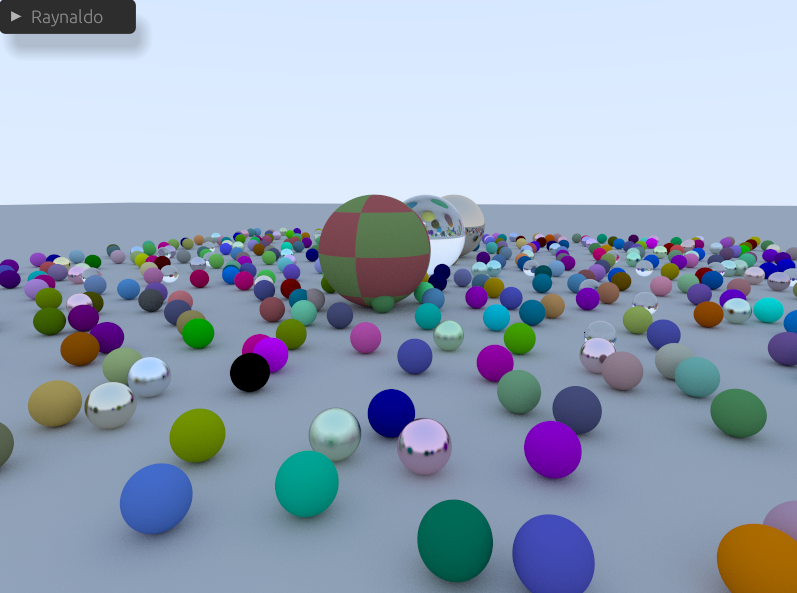
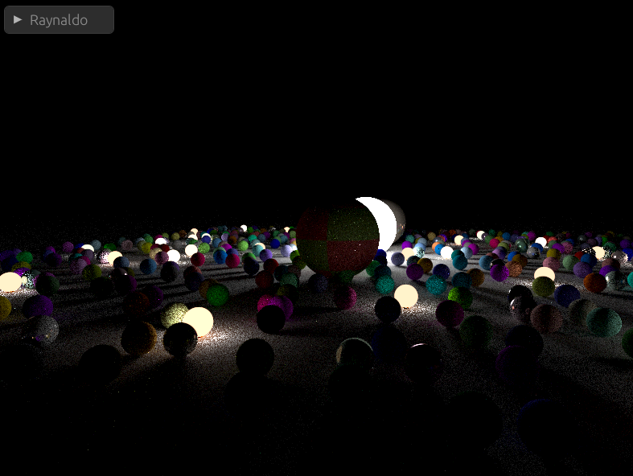
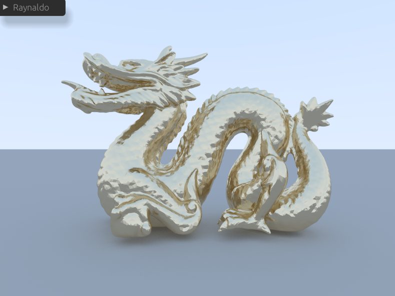
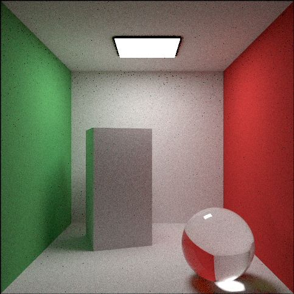
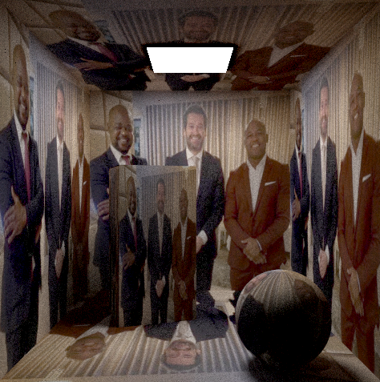

# Raynaldo Reborn

Raynaldo Reborn is a progressive, interactive path tracer written from scratch in Rust. It features a modern windowed UI, multithreaded CPU rendering, configurable tone mapping, a TOML-based scene format, and a high-performance acceleration raytracing BVH structure powered by Intel Embree.

> [!NOTE]  
> The name "Raynaldo Reborn" comes from the fact that it is a rewrite and upgrade of the original [Raynaldo](https://github.com/ivsop/raynaldo) raytracer. The first Raynaldo was a non-interactive raytracer with less organized code, and was itself based on a [raytracer example given by the professor](https://github.com/luisps/VI-RT-V5-MIS).

## Features

- **Progressive path tracing**: accumulates samples over time for increasingly clean images
- **Interactive windowed app**: built with `winit` (window/events), `wgpu` (GPU upload/display), and `egui` (immediate-mode UI)
- **Multithreading**: parallel per-pixel batches via `rayon`
- **Scene loading**: TOML world files and OBJ meshes (geometry only)
- **Acceleration structure**: Embree BVH backend for spheres and triangle meshes, with automatic conversion for quads and boxes

## Interactive application

The render loop integrates the window/event system, a CPU progressive renderer, and a GPU blit pass:

- CPU accumulates into an in-memory canvas that stores `(r_sum, g_sum, b_sum, sample_count)` per pixel.
- Work is dispatched in batches (e.g., 10k pixels) and parallelized; a configurable CPU time budget per frame balances responsiveness and throughput.
- On parameter changes (camera or render settings), the accumulation is reset. Multiple precomputed shuffled pixel orders are rotated to avoid visible scanning patterns while remaining efficient.
- After each iteration, the canvas is tone-mapped and uploaded as a texture to the GPU.

### Controls

- **W/A/S/D**: horizontal and forward/backward movement
- **Space / Left Shift**: move up / down
- **Hold Left Mouse**: rotate camera (yaw/pitch)

## Scene format (TOML)

Worlds are described in TOML with three main sections: `camera`, `environment`, and repeated `geometry` entries.

```toml
[camera]
position = [1.85, 1.85, -4.0]
yaw = 90.0
pitch = 0.0
fov = 60.0
focus_distance = 0.1
defocus_angle = 0.0

[environment]
type = "sky" # or "color"

[[geometry]]
type = "sphere"
center = [0.0, 0.0, 0.0]
radius = 1.0
material = "lambertian"
texture = "solid"
color = [0.7, 0.3, 0.3, 1.0]
```

### Supported geometry

- **Sphere**

```toml
[[geometry]]
type = "sphere"
center = [0.87, 0.5, 0.43]
radius = 0.5
material = "dielectric"
refractive_index = 1.5
```

- **Quad** (planar rectangle by basis vectors)

```toml
[[geometry]]
type = "quad"
origin = [0.0, 0.0, 3.7]
u = [3.7, 0.0, 0.0]
v = [0.0, 0.0, -3.7]
material = "lambertian"
texture = "solid"
color = [0.73, 0.73, 0.73, 1.0]
```

- **Triangle mesh** (from OBJ)

```toml
[[geometry]]
type = "triangle_mesh"
mesh_type = "obj_file"
path = "assets/dragon8k.obj"
material = "metal"
albedo = [0.9, 0.8, 0.6, 1.0]
fuzziness = 0.1
```

- **Box** (oriented by three basis vectors)

```toml
[[geometry]]
type = "box"
origin = [1.76, 0.0, 1.96]
u = [1.046, 0.0, -0.340]
v = [0.0, 2.2, 0.0]
w = [0.340, 0.0, 1.046]
material = "lambertian"
texture = "solid"
color = [0.73, 0.73, 0.73, 1.0]
```

### Materials

- **Lambertian**: supports `solid`, `checker`, and `image` textures

```toml
# Solid color
material = "lambertian"
texture = "solid"
color = [0.7, 0.3, 0.3, 1.0]

# Checkerboard
material = "lambertian"
texture = "checker"
color1 = [0.2, 0.3, 0.1, 1.0]
color2 = [0.9, 0.9, 0.9, 1.0]
scale = 0.32

# Image texture
material = "lambertian"
texture = "image"
image = "assets/img.png"
```

- **Metal**

```toml
material = "metal"
albedo = [0.8, 0.8, 0.9, 1.0]
fuzziness = 0.1
```

- **Dielectric**

```toml
material = "dielectric"
refractive_index = 1.5
```

- **Emissive**

```toml
material = "emissive"
color = [1.0, 1.0, 1.0, 1.0]
intensity = 15.0
```

### OBJ loading

OBJ meshes are loaded via `tobj`. Materials from the OBJ are not currently imported; assign materials in the TOML world file.

## Acceleration via Embree (BVH)

Embree is used to accelerate intersection on complex scenes:

- Native primitives: triangles and spheres
- Converted on upload: quads → 2 triangles; boxes → 6 quads → 12 triangles
- UV coordinates are reconstructed per primitive (spherical, barycentric, or bilinear) after Embree reports intersections

Benchmark (800×600, 5 SPP, Ryzen 7 7700X):

| Tracer | dragon8k.toml | dragon80k.toml |
|---|---:|---:|
| Naive | 36.5s | 355.6s |
| Embree | 0.096s | 0.112s |

## Demo renders

Examples rendered at 2000 SPP:








## How to run

### Installing Intel Embree

Embree is required for the high-performance ray tracing backend. Install it according to your operating system:

#### Windows
1. Download Embree from [Intel's official releases](https://github.com/embree/embree/releases)
2. Extract the archive and add the `embree/bin` directory to your PATH and `embree/lib` to your LIB environment variable

#### macOS
```bash
brew install embree
```

#### Linux (Ubuntu/Debian)
```bash
# Install development packages
sudo apt update
sudo apt install libembree-dev
```

If you get `stddef.h` errors, try instaling clang.

### Rust Requirements

- **Rust**: Install from [rustup.rs](https://rustup.rs/)
- **Minimum version**: Rust 2024 edition (latest stable recommended)

### Running

```bash
# Using a sample scene
cargo run --release -- assets/worlds/cornell_box.toml

# Specify tracer backend explicitly
cargo run --release -- assets/worlds/dragon8k.toml --tracer embree
cargo run --release -- assets/worlds/balls.toml --tracer naive # Very slow
```
